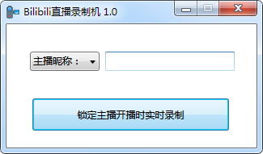
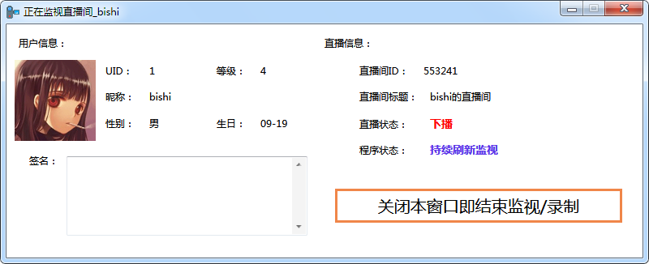
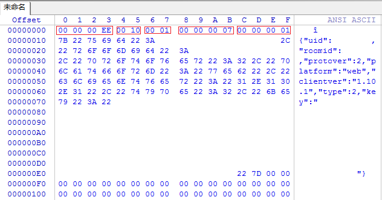
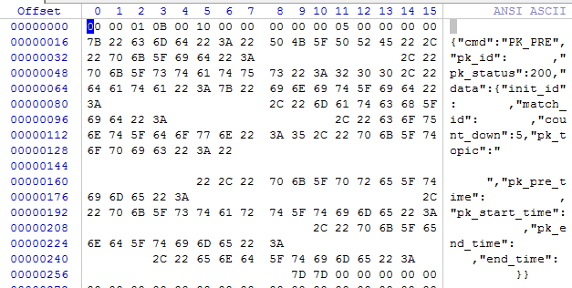
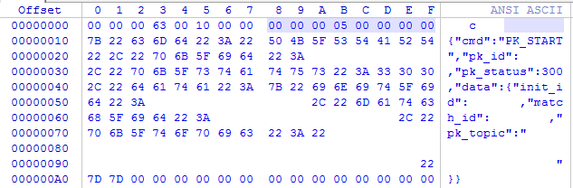
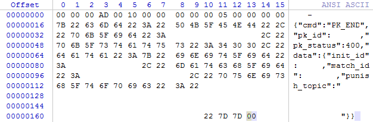
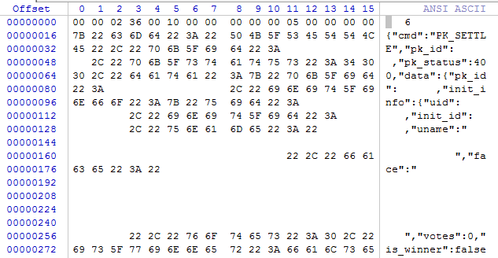
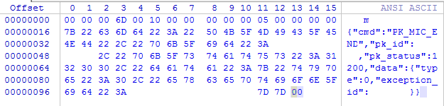

# BiliLiveRecorder

> B站直播录制机

下载地址：

### [BiliLiveRecorder](https://injectrl.github.io/BiliLiveRecorder/BiliLiveRecorder/bin/Release/BiliLiveRecorder.exe)

---

* 特性

	1. 多直播间同时监视、下载

	2. 持续监视直播间，开播及时录制

	3. 可使用 UID 或 用户昵称 搜索主播

	4. 支持同时下载直播弹幕(XML)

* 界面预览

	

	

---

* 接口获取

	1. 直播间页面查看网络活动找到直播间信息接口

		https://api.live.bilibili.com/xlive/web-room/v1/index/getInfoByRoom?room_id={直播间ID}

	2. 用户主页查看网络活动找到用户信息接口和直播间入口接口（旧）

		https://api.bilibili.com/x/space/acc/info?mid={UID}

		https://api.live.bilibili.com/room/v1/Room/getRoomInfoOld?mid={UID}

	3. 通过直播间页面加载的[player-loader-1.10.1.min.js](https://s1.hdslb.com/bfs/static/player/live/loader/player-loader-1.10.1.min.js)搜索(api.live.bilibili.com)可找到下列接口：

		https://api.live.bilibili.com/room/v1/Room/playUrl

		https://api.live.bilibili.com/room/v1/room/get_recommend_by_room

		https://api.live.bilibili.com/room/v1/Room/room_init

		https://api.live.bilibili.com/room/v1/Danmu/getConf

	4. 在[用户搜索页面](https://search.bilibili.com/upuser?keyword=)查看网络活动找到用户搜索接口

		https://api.bilibili.com/x/web-interface/search/type?context=&keyword={搜索条件}&page=1&order=&category_id=&duration=&user_type=&order_sort=&tids_1=&tids_2=&search_type=bili_user&changing=mid&__refresh__=true&__reload__=false&highlight=1&single_column=0&jsonp=jsonp&callback=__jp3

		用户搜索条件做相应修改后：

		https://api.bilibili.com/x/web-interface/search/type?page=1&search_type=bili_user&changing=mid&__refresh__=true&__reload__=false&highlight=1&single_column=0&jsonp=jsonp&keyword={搜索条件}

	5. 直播间页面可找到弹幕服务器获取接口

		https://api.live.bilibili.com/room/v1/Danmu/getConf?room_id={直播间ID}

	6. 结合直播时抓包结果连接上述弹幕服务器，下为握手包示例，JSON中可保留uid与roomid

		握手包:

		

		准备进入PK:

		

		开始PK:

		

		PK第一段结束:

		

		PK惩罚阶段信息:

		

		PK连麦结束:

		

		程序将在 开始PK后5秒 与 PK连麦结束后15秒 分段